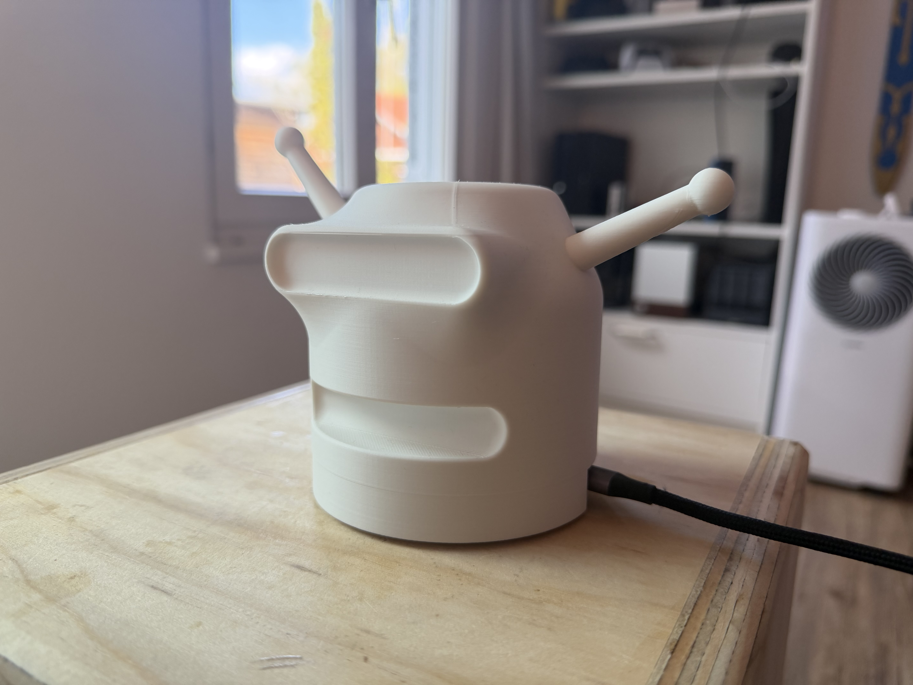
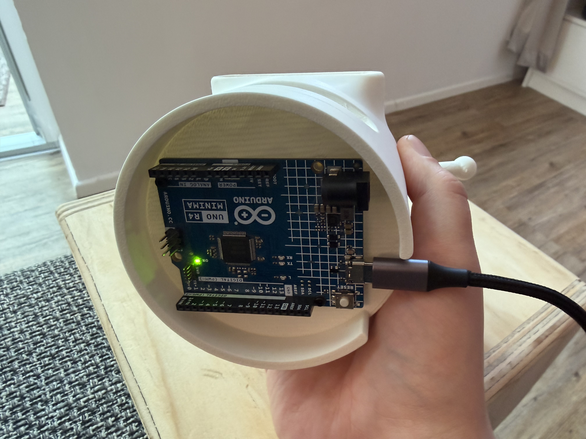

# Mikrocontroller-Kalkulator

Ein einfaches Projekt zur Kommunikation zwischen **PC-Anwendung** und **Mikrocontroller** über eine serielle Schnittstelle.  
Die PC-Anwendung sendet Rechenausdrücke wie `34 * 72` an den Mikrocontroller. Der Mikrocontroller parst den Ausdruck, berechnet das Ergebnis und sendet die Antwort zurück.

Das Projekt wurde mit einem **Arduino Uno R4 Minima** umgesetzt. Die PC-Seite ist als **C++-Konsolenanwendung** realisiert.

## Funktionen

- serielle Kommunikation zwischen PC und Mikrocontroller
- Eingabe einfacher Rechenausdrücke mit zwei Operanden
- unterstützte Operatoren: `+`, `-`, `*`, `/`
- Rückgabe von Ergebnissen und Fehlercodes
- Speichern des kompletten Nachrichtenaustauschs in eine Textdatei
- lauffähige macOS-Binärdatei als GitHub-Release

## Projektstruktur

```text
mikrocontroller-kalkulator/
├── firmware/
│   └── arduino_calculator.ino
├── pc-client/
│   ├── microcontroller_pc_client.cpp
│   ├── CMakeLists.txt
│   └── README_PC_Client.md
└── docs/
```

## Verwendete Komponenten

### Hardware
- Arduino Uno R4 Minima
- USB-Verbindung zwischen Mikrocontroller und PC

### Software
- Arduino IDE
- C++17-kompatibler Compiler, z. B. `clang++`
- macOS-Terminal

## Funktionsweise

1. Der Mikrocontroller startet die serielle Kommunikation mit `115200` Baud.
2. Die PC-Anwendung öffnet die serielle Schnittstelle.
3. Im Terminal wird ein Ausdruck wie `34 * 72` eingegeben.
4. Der Ausdruck wird als String an den Mikrocontroller gesendet.
5. Der Mikrocontroller verarbeitet die Eingabe und sendet eine Antwort zurück.
6. Die PC-Anwendung zeigt die Antwort an und kann den Nachrichtenaustausch speichern.

## Antwortformat des Mikrocontrollers

### Erfolgreiche Antwort
```text
OK <Ergebnis>
```

Beispiele:
```text
OK 2448
OK 2.500000
```

### Fehlerantworten
```text
ERR parse
ERR op
ERR div0
ERR overflow
```

## Firmware auf den Arduino laden

1. Datei `firmware/arduino_calculator.ino` in der Arduino IDE öffnen
2. Board **Arduino Uno R4 Minima** auswählen
3. Richtigen Port auswählen
4. Sketch auf das Board hochladen
5. Seriellen Monitor danach schließen, damit die PC-Anwendung auf den Port zugreifen kann

## PC-Client unter macOS kompilieren

Im Projektverzeichnis:

```bash
clang++ -std=c++17 -Wall -Wextra -pedantic pc-client/microcontroller_pc_client.cpp -o microcontroller_pc_client
```

## PC-Client starten

Zuerst den seriellen Port ermitteln:

```bash
ls /dev/cu.*
```

Dann den Client starten, zum Beispiel:

```bash
./microcontroller_pc_client /dev/cu.usbmodem1101 115200
```

## Bedienung

Nach dem Start können direkt Rechenausdrücke eingegeben werden:

```text
34 * 72
10 / 4
5 + 9
```

Beispielausgabe:

```text
[uC] OK ready
> 34 * 72
[uC] OK 2448
> 10 / 4
[uC] OK 2.500000
```

Zusätzliche Befehle der PC-Anwendung:

```text
:help
:save protokoll.txt
:quit
```

## Beispieltests

### Gültige Eingaben
```text
34 * 72
10 / 4
5 + 9
15 - 8
```

### Fehlerfälle
```text
10 / 0
abc + 5
4 ^ 2
```

Erwartete Rückgaben:

```text
ERR div0
ERR parse
ERR op
```
## 3D-Gehäuse im Calculon-Design

Um das Projekt zusätzlich gestalterisch aufzuwerten, wurde ein eigenes 3D-Gehäuse entworfen.  
Das Gehäuse ist an den Kopf von **Calculon** aus *Futurama* angelehnt. Im unteren Bereich wurde ein passender Einschub modelliert, sodass der **Arduino Uno R4 Minima** im Gehäuse untergebracht werden kann.

### Bilder





### 3D-Datei

Die STL-Datei des Gehäuses befindet sich im Repository unter:

[`assets/3d/Calculon.stl`](assets/3d/Calculon.stl)

Damit ist neben der Software auch ein individuell gestaltetes Hardware-Element Teil des Projekts.
## Release

Eine vorkompilierte macOS-Version steht im Release-Bereich des Repositories bereit.

Repository: https://github.com/Kilian3000/mikrocontroller-kalkulator  
Releases: https://github.com/Kilian3000/mikrocontroller-kalkulator/releases

Hinweis: Die aktuell hochgeladene Binärdatei ist für **macOS arm64** erstellt. Auf anderen Systemen oder Intel-Macs sollte der Client aus dem Quellcode kompiliert werden.

## Dokumentation

Die ausführlichere Projektdokumentation für den Kurs wird separat als PDF erstellt.  
Dort werden zusätzlich beschrieben:

- Systemarchitektur
- Modulstruktur
- UML-Diagramm
- Testkonzept
- Reflexion der Umsetzung

## Autor

Kilian Herbst
